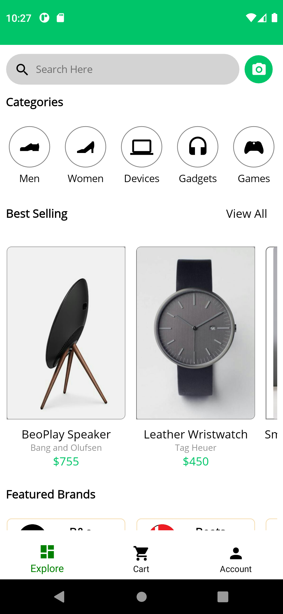
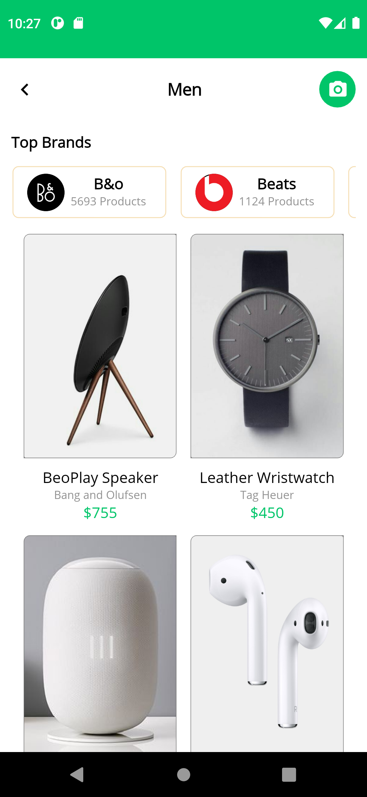
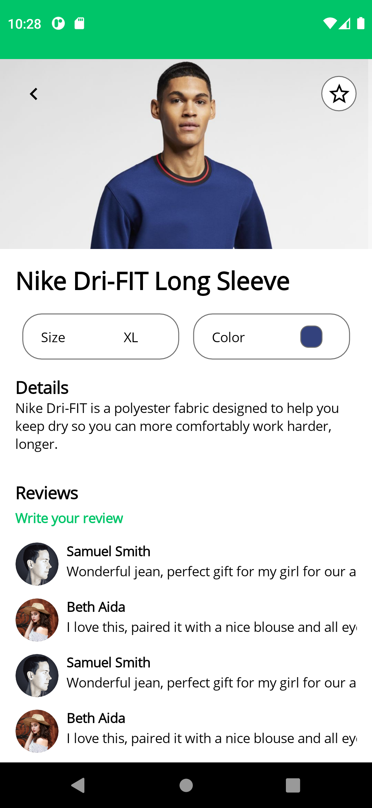
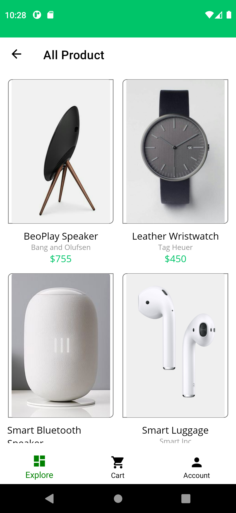
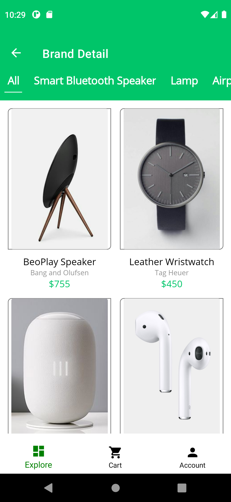
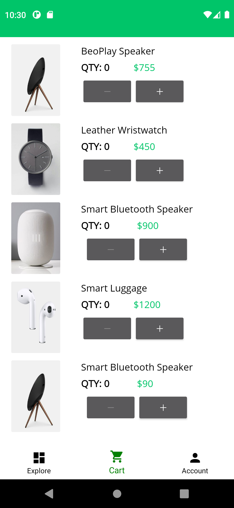
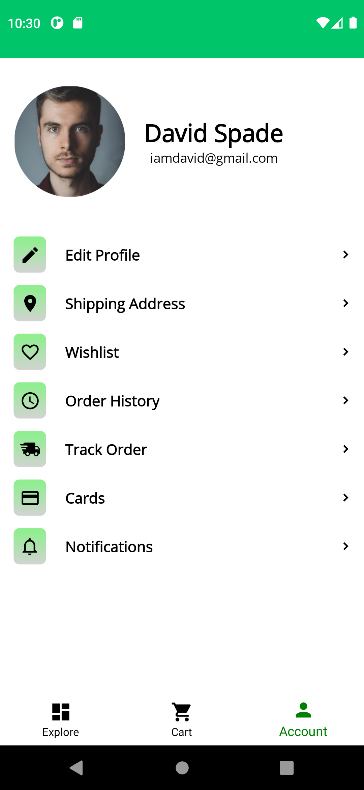
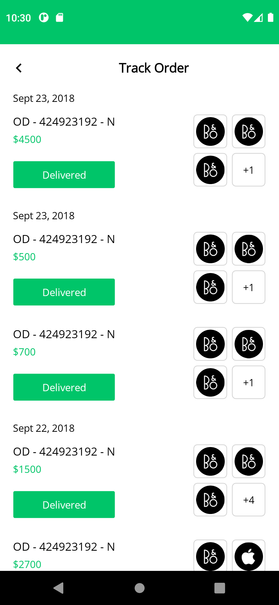
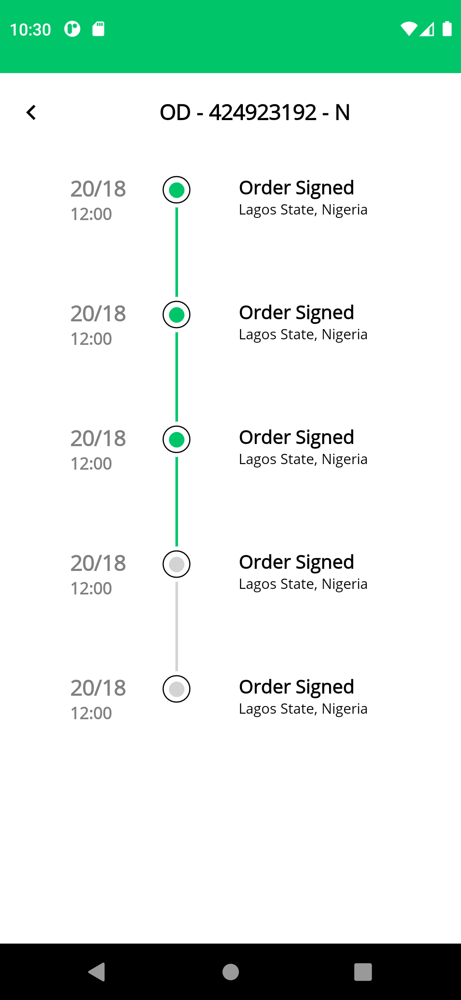

Mobile-app

# Ecommerce Design Approach

Ecommerce design with NET MAUI (MVVM Pattern)

## Features
* ColletionView
* SwipeView
* MVVM
* Font Icon
* Borders
* Color gradient brushes
* Stepper

## Generate C# code from icon font
Link: https://andreinitescu.github.io/IconFont2Code/

## Screenshots
 &nbsp;&nbsp;&nbsp; 
 &nbsp;&nbsp;&nbsp; 
  
 &nbsp;&nbsp;&nbsp; 
  &nbsp;&nbsp;&nbsp;
  
 &nbsp;&nbsp;&nbsp; 
&nbsp;&nbsp;&nbsp; 
 
